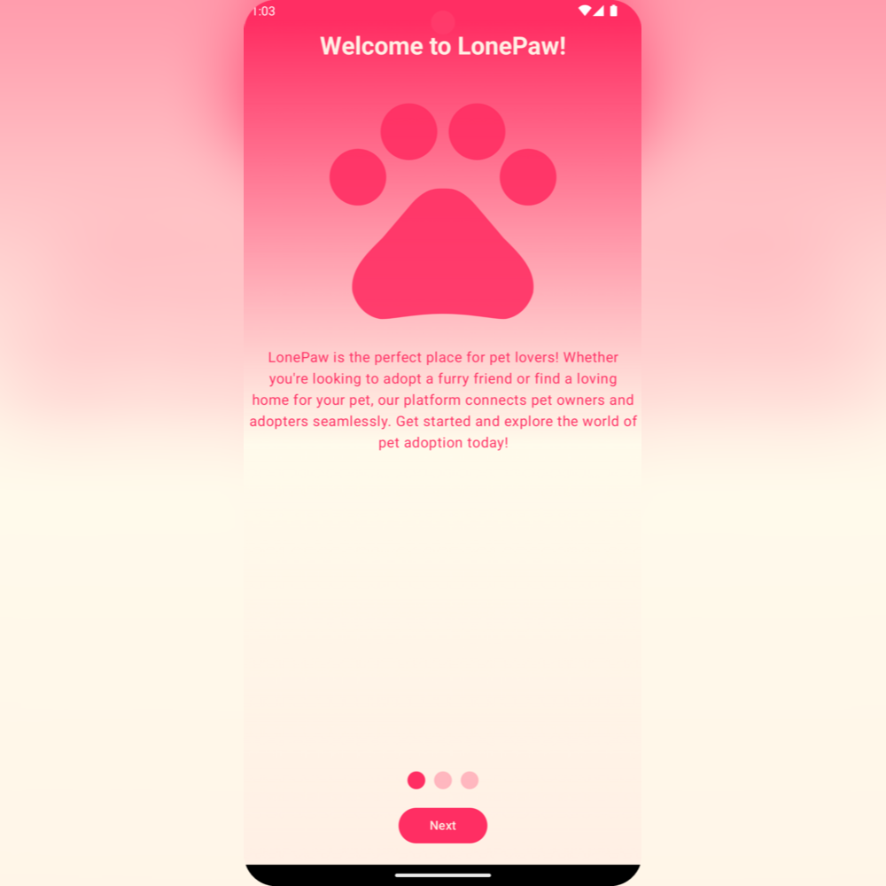
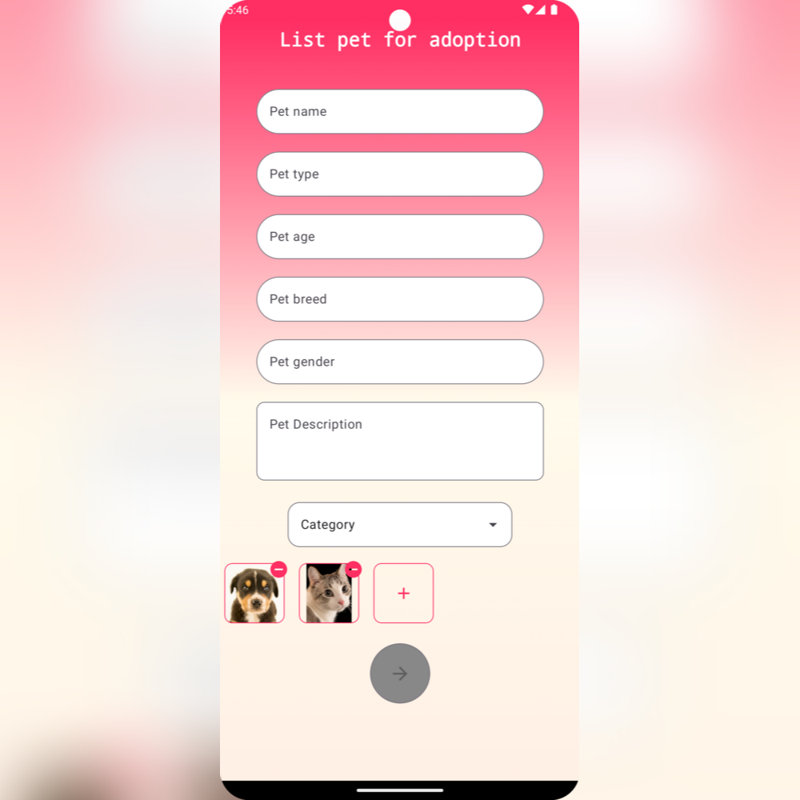
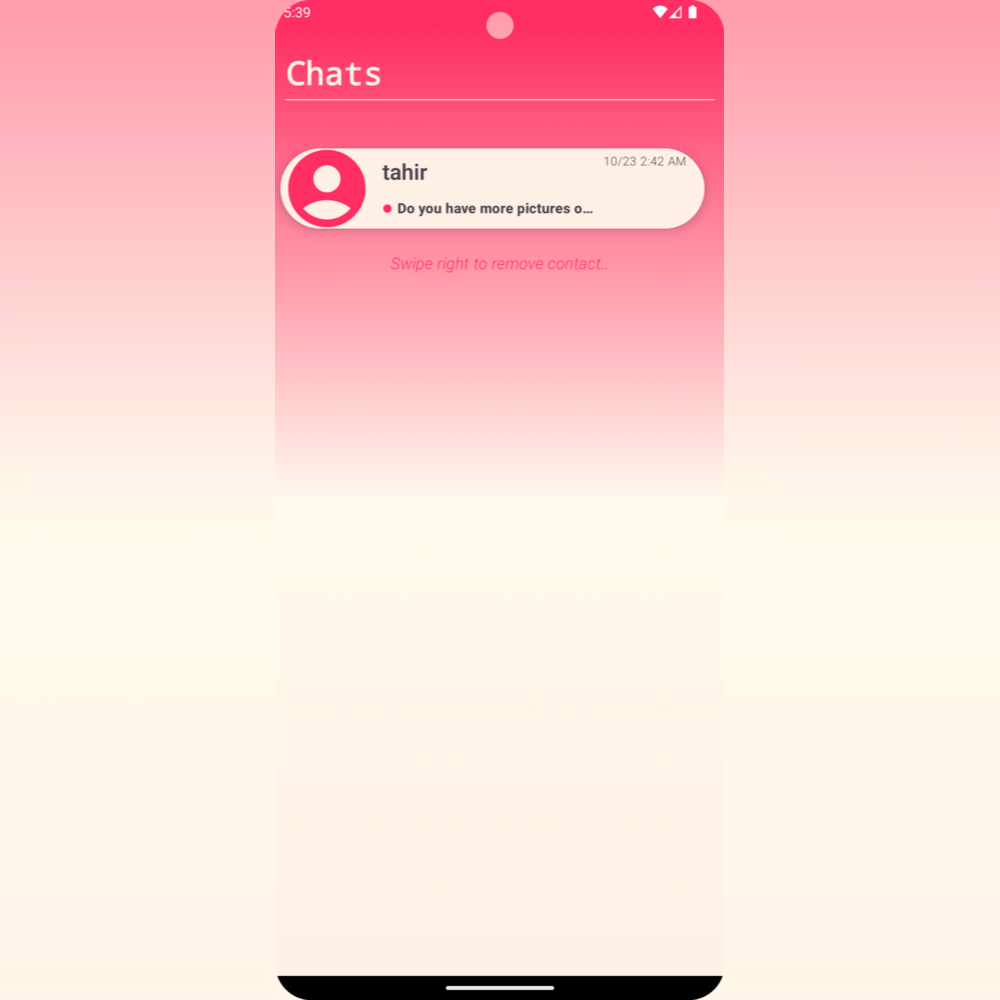

# LonePaw Pet Adoption App

LonePaw is a pet adoption app that allows users to connect with pet owners looking to rehome their pets. Whether you're looking to adopt a pet or find a new home for your furry friend, LonePaw provides a platform to facilitate these connections. With features like pet liking, pet search, category-based pet browsing, and chat functionality with pet owners, LonePaw makes the adoption process seamless and enjoyable.
  

## Features

- **Adopt Pets**: Browse through a wide selection of pets available for adoption from pet owners.
- **List Pets for Adoption**: Owners can list their pets for adoption, providing details and photos to attract potential adopters.
- **Like Pets**: Users can express interest in pets by liking them, making it easier to keep track of favorites.
- **Search**: Find pets based on specific criteria such as species, breed, age, and location.
- **Category-Based Browsing**: Explore pets by categories such as cats, dogs, birds, hamsters, rabbits, and others.
- **Chat with Owners**: Communicate directly with pet owners via the in-app chat feature to ask questions or arrange meetups.
- 
- 
- 
- 
- 
- 

## Technologies Used

This app leverages a range of modern technologies to deliver a robust and efficient application. Below are the key technologies and libraries utilized:

- **[Kotlin](https://kotlinlang.org/)**: The primary programming language for developing the app, known for its concise syntax and powerful features for Android development.
- **[Jetpack Compose](https://developer.android.com/jetpack/compose)**: A modern Android UI toolkit used to build native UI components with a declarative approach, enabling fast and efficient UI creation.
- **[Ktor](https://ktor.io)**: A type-safe HTTP client used for API integration, enabling the app to fetch recipe data from external sources efficiently.
- **[Room](https://developer.android.com/training/data-storage/room)**: An SQLite object mapping library for local database management, providing offline access to saved recipes.
- **[MVI (Model-View-Intent)](https://developer.android.com/topic/architecture)**: The architectural pattern adopted to manage the flow of data and state within the app in a predictable manner.
- **[MVVM (Model-View-ViewModel)](https://developer.android.com/topic/architecture)**: An architectural pattern used to separate concerns, allowing for a more modular and testable codebase.
- **[Retrofit](https://square.github.io/retrofit/)**: A type-safe HTTP client for Android and Java used for making API requests.
- **[Dagger Hilt](https://dagger.dev/hilt/)**: A dependency injection library that simplifies the implementation of DI patterns within the app.
- **[Glide](https://bumptech.github.io/glide/)**: An image loading and caching library for Android, used to efficiently display recipe images.
- **[Firebase Firestore](https://firebase.google.com/products/firestore)**: A NoSQL cloud database for storing and syncing recipe data in real time.
- **[PHP Laravel](https://laravel.com/)**: A backend framework used for building the API that supports server-side functionalities for the app.

## Installation

To use the LonePaw app,
you can download it from the following link: 
[LonePaw apk](https://www.mediafire.com/file/6laeyh01iwhkuoh/LonePaw.apk/file)

## Contributing

Contributions to LonePaw are welcome! If you'd like to contribute to the project, please follow these steps:

1. Fork the repository.
2. Create a new branch for your feature or bug fix.
3. Make your changes and commit them with descriptive messages.
4. Push your changes to your fork.
5. Submit a pull request to the main repository.

Please ensure that your code follows the project's coding standards and conventions.

## License

The LonePaw app is open-source software licensed under the [MIT License](LICENSE). Feel free to use, modify, and distribute the app according to the terms of the license.

## Contact

If you have any questions, suggestions, or feedback about LonePaw, please contact us at [fatabdella7@gmail.com](mailto:fatabdella@gmail.com).
